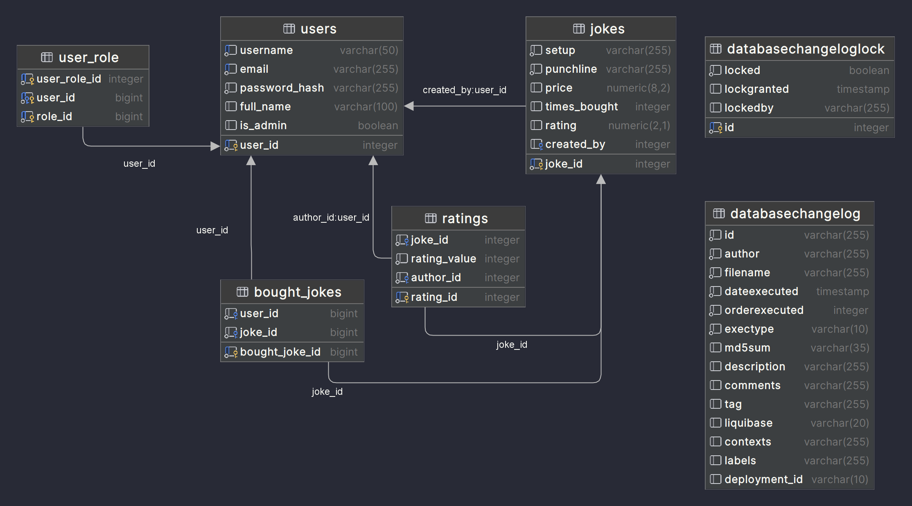

# lyhike-nimi-back

## Database diagram


## Features

- Browse a collection of various setups.
- Purchase punchlines to the selected setups.
- Add selected punchlines to a cart for easy checkout.
- Convenient payment options for a seamless shopping experience.

## Technologies Used
 - Java 18
 - Spring Boot
 - Spring Security
 - Spring Data JPA
 - Hibernate
 - PostgreSQL
 - Gradle
 - Lombok
 - MapStruct

## Contributors

- Indrek Pihl - Software Developer
- Nele Liis Sams - Software Developer/Designer
- Mattias Raba - Software Developer

## Install and Setup

Follow these steps to configure the project on your local machine for development and testing. Ensure you have
the following prerequisites installed:
- Java version 17 or later
- PostgreSQL version 16 or later (with the database already running)

### Setup
Clone the repository using the command:

```git clone https://gitlab.cs.taltech.ee/maraba/lyhike-nimi-back.gitNavigate```

Navigate to the project directory:

```cd lyhike-nimi-back```

Locate the application.properties file in the src/main/resources/ directory and populate it with the correct
database connection details and any other necessary configurationsBuild the project (this will also download the
necessary dependencies):

```./gradlew build```

Run the application:

```./gradlew bootRun```

By following these steps, you'll have the project set up and ready for development and testing on your local machine.
